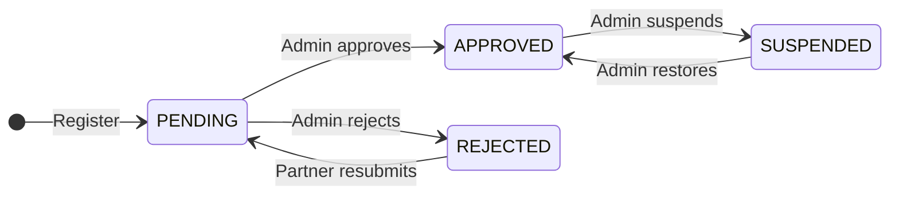
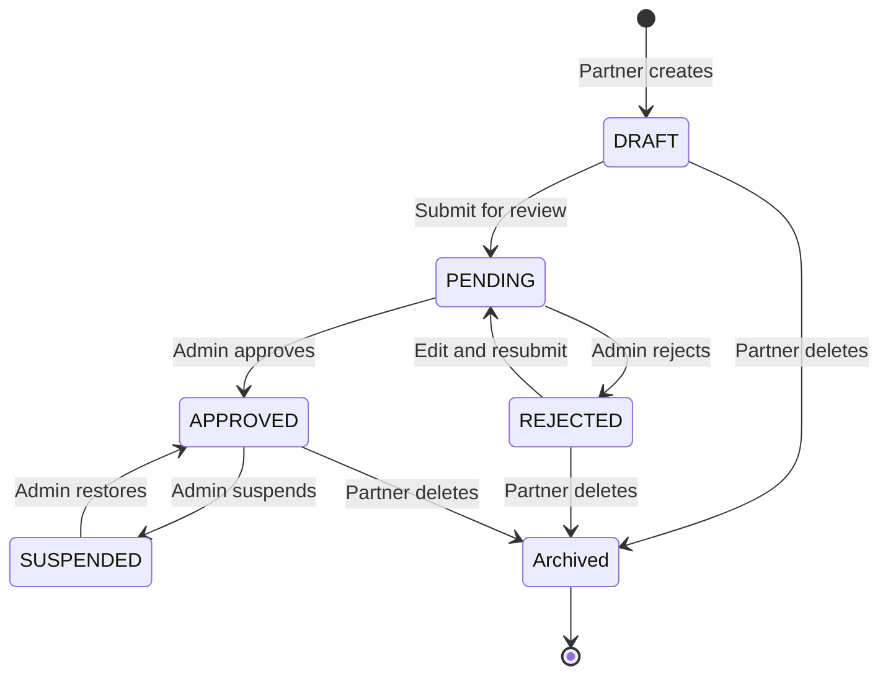
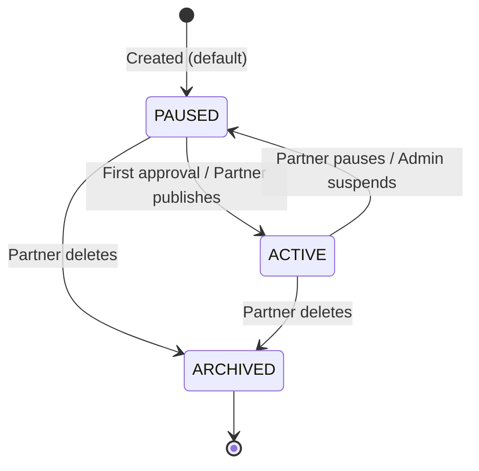
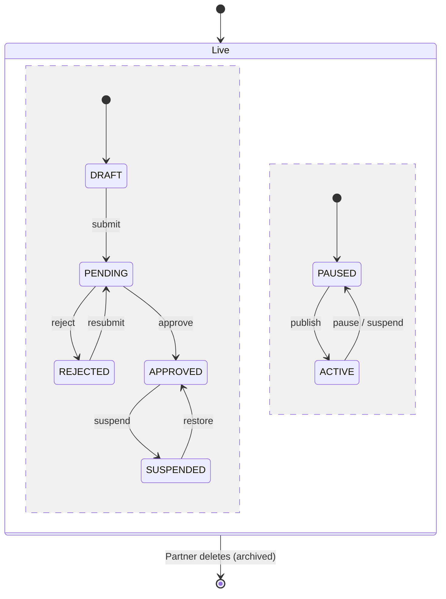
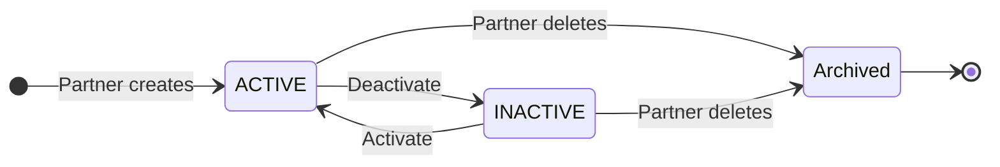
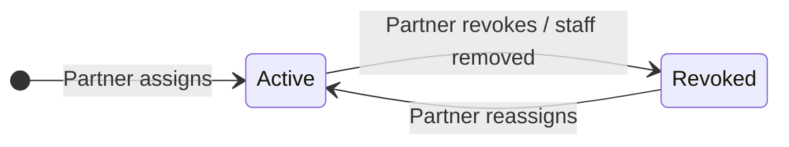
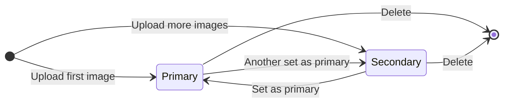
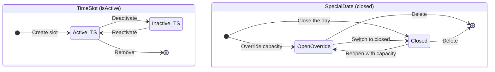

# Module 5 – Partner Management: Prompt & Code State Diagram (phần của Lộc)

> Dữ liệu trạng thái + điều kiện chuyển được rút trực tiếp từ mã nguồn:
> `schema.prisma`, `attractionController.js`, `adminController.js`,
> `ticketController.js`, `partnerController.js`, `partnerStaffController.js`,
> `attractionWorkflowService.js`.

---

## KẾT QUẢ KIỂM TRA ĐỐI CHIẾU CODE (đã rà lần 2)

Đã đọc trực tiếp: `schema.prisma`, `attractionController.js` (create/submit/publish/delete),
`adminController.js` (review/suspend/restore partner & attraction, `nextPublicationStatusAfterApproval`),
`partnerController.js` (register/resubmit), `ticketController.js`, `partnerStaffController.js`,
`attractionWorkflowService.js`.

| Sơ đồ | Trạng thái | Ghi chú kiểm tra |
|---|---|---|
| B1 PartnerProfile | ✅ Chính xác | REJECTED→PENDING chỉ khi resubmit; SUSPENDED **không** tự đăng ký lại được (chỉ admin gỡ). Guard duyệt: chỉ khi PENDING. |
| B2 Attraction (status) | ✅ Đã sửa | Bỏ `ARCHIVED` khỏi máy status (nó thuộc publicationStatus). Xóa chỉ set `archivedAt`, status giữ nguyên. |
| B3 Attraction (publicationStatus) | ✅ Đã sửa | **Duyệt lần đầu → ACTIVE** (không phải PAUSED). Duyệt lại giữ nguyên; đình chỉ ép PAUSED. |
| B2b Bản gộp orthogonal | ✅ Mới thêm | Cho SRS cần 1 sơ đồ duy nhất cho Attraction. |
| B4 TicketProduct | ✅ Chính xác + rõ hơn | Thêm chú thích: sửa vé của địa điểm đã publish đi qua `draftData`, chỉ ghi DB khi duyệt lại. |
| B5 StaffAttractionAssignment | ✅ Chính xác | Tái phân công = upsert `revokedAt=null`; xóa nhân viên cũng revoke. |
| B6 AttractionImage | ✅ Chính xác | `setPrimaryImage` hạ primary cũ; xóa primary tự thăng ảnh kế. |
| B7 TimeSlot / SpecialDate | ✅ Chính xác (lifecycle) | Không có enum status; TimeSlot dùng `isActive`, SpecialDate dùng `closed`. |

**2 lỗi đã sửa so với bản đầu:** (1) publicationStatus lần duyệt đầu là ACTIVE; (2) ARCHIVED không phải giá trị của `status`.

---

## PHẦN A — PROMPT CHUẨN ĐỂ VẼ STATE DIAGRAM

Đây là template prompt tái sử dụng cho từng entity. Điền phần `{{...}}` rồi
gửi cho AI (hoặc dùng làm checklist tự vẽ). Prompt buộc AI bám sát code thật,
không bịa trạng thái.

```
Bạn là chuyên gia thiết kế phần mềm. Hãy vẽ State Machine Diagram (UML) cho
entity "{{TÊN ENTITY}}" trong hệ thống đặt vé du lịch VietTicket.

BỐI CẢNH:
- Trường lưu trạng thái: {{tên field, vd: status: AttractionStatus}}
- Tập trạng thái hợp lệ (KHÔNG được thêm/bớt): {{liệt kê enum}}
- Trạng thái khởi tạo: {{initial state}}
- Trạng thái kết thúc (nếu có): {{final state}}

CÁC PHÉP CHUYỂN TRẠNG THÁI (nguồn: code, không suy diễn):
{{liệt kê dạng: FROM --> TO : <tác nhân> / <sự kiện> [điều kiện guard]}}

YÊU CẦU ĐẦU RA:
1. Xuất ra code Mermaid `stateDiagram-v2` (ưu tiên) VÀ mô tả PlantUML tương đương.
2. Mỗi transition ghi rõ: tác nhân (Actor), sự kiện (event/API), guard trong [].
3. Có [*] --> initial và state --> [*] cho trạng thái kết thúc.
4. Dùng note để giải thích nếu có 2 state machine song song.
5. KHÔNG bịa thêm trạng thái ngoài danh sách đã cho.
6. Tên trạng thái giữ nguyên chữ hoa như enum trong code.
```

**Ví dụ điền sẵn cho Attraction** (dán thẳng vào chỗ `{{...}}`):

- Trường trạng thái: `status: AttractionStatus` **và** `publicationStatus: AttractionPublicationStatus` (2 máy trạng thái song song)
- Enum status: `DRAFT, PENDING, APPROVED, REJECTED, SUSPENDED`
- Enum publicationStatus: `PAUSED, ACTIVE, ARCHIVED`
- Initial: `status=DRAFT` / `publicationStatus=PAUSED`
- Transitions (status):
  - `DRAFT --> PENDING : Partner / submit gửi duyệt [snapshot hợp lệ]`
  - `REJECTED --> PENDING : Partner / gửi duyệt lại`
  - `PENDING --> APPROVED : Admin / duyệt (set publishedAt)`
  - `PENDING --> REJECTED : Admin / từ chối [có rejectionReason]`
  - `APPROVED --> SUSPENDED : Admin / đình chỉ [status=APPROVED & đã publishedAt]`
  - `SUSPENDED --> APPROVED : Admin / khôi phục`
- Transitions (publicationStatus):
  - `PAUSED --> ACTIVE : Admin / DUYỆT LẦN ĐẦU (publishedAt=null ⇒ tự phát hành ACTIVE)`
  - `PAUSED --> ACTIVE : Partner / bật bán vé [đã publishedAt & status≠SUSPENDED]`
  - `ACTIVE --> PAUSED : Partner / tạm dừng bán vé  |  Admin / đình chỉ`
  - `PAUSED,ACTIVE --> ARCHIVED : Partner / xóa (set archivedAt, status giữ nguyên)`

---

## PHẦN B — CÁCH TẠO CODE → RA SƠ ĐỒ

Có, hoàn toàn tạo được từ code. 3 lựa chọn phổ biến (chọn 1):

| Công cụ | Cú pháp | Cách render |
|---|---|---|
| **Mermaid** (khuyến nghị) | `stateDiagram-v2` | Dán vào https://mermaid.live , VS Code (extension "Markdown Preview Mermaid"), GitHub `.md`, draw.io (Arrange → Insert → Advanced → Mermaid) |
| **PlantUML** | `@startuml ... @enduml` | https://www.plantuml.com/plantuml , VS Code extension "PlantUML" |
| **draw.io** | vẽ tay hoặc import Mermaid | app.diagrams.net |

Dưới đây là **code Mermaid sẵn sàng** cho cả 7 sơ đồ. Dán từng block vào
mermaid.live để xuất PNG/SVG.

---

### B1. PartnerProfile



> **QUAN TRỌNG — Attraction có 2 máy trạng thái CHẠY SONG SONG (orthogonal):**
> `status` (vòng kiểm duyệt của Admin) và `publicationStatus` (đối tác bật/tắt bán
> vé). Ngoài ra `archivedAt` là cờ soft-delete cắt ngang cả hai. `ARCHIVED` chỉ là
> giá trị của `publicationStatus`, **KHÔNG** phải giá trị của `status` — khi xóa,
> `status` được giữ nguyên, chỉ `archivedAt` + `publicationStatus=ARCHIVED` thay đổi.
> Vẽ 3 sơ đồ: B2 (status), B3 (publicationStatus), B2b (bản gộp orthogonal chuẩn UML).

### B2. Attraction – Máy trạng thái KIỂM DUYỆT (`status: AttractionStatus`)

Tập trạng thái hợp lệ: `DRAFT, PENDING, APPROVED, REJECTED, SUSPENDED` (không có ARCHIVED).



### B3. Attraction – Máy trạng thái PHÁT HÀNH (`publicationStatus`)

Tập trạng thái hợp lệ: `PAUSED, ACTIVE, ARCHIVED`. Chỉ có ý nghĩa sau khi có `publishedAt`.



### B2b. Attraction – Bản GỘP orthogonal (chuẩn UML, tùy chọn)

Thể hiện đúng bản chất "2 vùng đồng thời". Dùng bản này nếu SRS yêu cầu 1 sơ đồ duy nhất cho Attraction.



*Vùng bên trái = `status`, vùng bên phải = `publicationStatus` — hai vùng chạy đồng thời.*

### B4. TicketProduct (`status: TicketStatus` + `archivedAt`)



### B5. StaffAttractionAssignment



### B6. AttractionImage (lifecycle – không có enum status)



### B7. TimeSlot & SpecialDate (lifecycle đơn giản)


```
